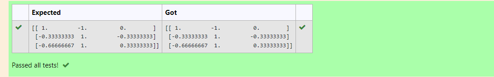

# INVERSE-OF-A-MATRIX
## Aim:
To write a python program to find the inverse of a matrix
## Equipment’s required:
1. 	Hardware – PCs
2. 	Anaconda – Python 3.7 Installation / Moodle-Code Runner
## Algorithm:
### Step1 : 
import the numpy module to use the built in function for calculate
### Step 2: 
prapare the lists from each linear eqations and assign in np.array()

### Step 3: 
Using the np.linalg.inv(), we can find the inverse of the given matrix.
### Step 4: 
End the program

## Program:
```
#Program to find the inverse of a matrix.
#Developed by: Rajeshkannan.M
#RegisterNumber:21500434
import numpy as np
a=np.array([[2,1,1],[1,1,1,],[1,-1,2]])
values=np.linalg.inv(a)
print(values)
```
## Output:

## Result:
Thus the inverse of given matrix is successfully solved using python program

